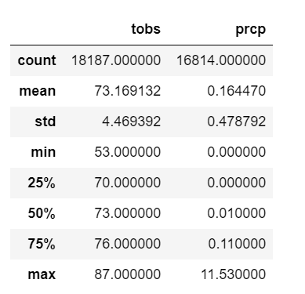
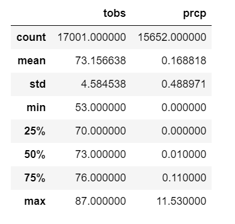
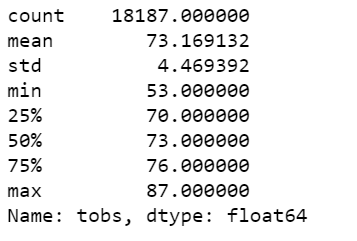
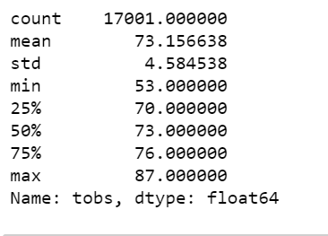
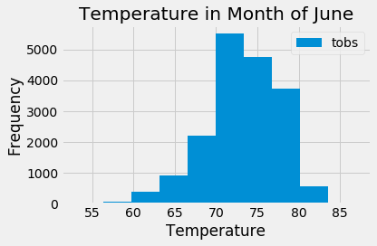
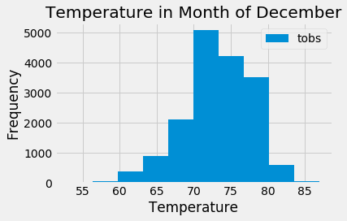
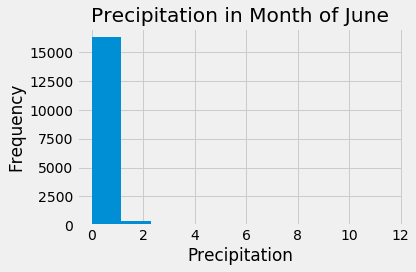
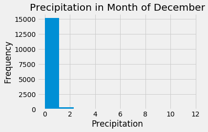

# surfs_up
# Module 9 challenge

### Analysis
As seen in fligures below for temperature and precipitation. As Hawaii has temp same whole year so its hard to point out difference
* Number of data points are more in June than December.
* Mean temperature/precipitaition for all the years from 2010 to 2017 is almost same for both December and June.
* Maximum frequency of temperature is for both month of December and June is between 70-75 degrees.
#### June Stat

#### December Stat
 
### Average June Temperature for all stations

### Average December Temperature for all stations

### Average June Temperature for all stations histragram

### Average December Temperature for all stations histagram

### Average June Precipitation for all stations

### Average December Precipitation for all stations

